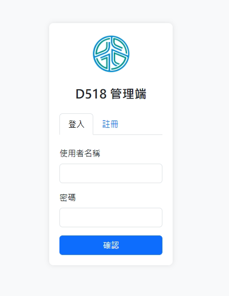
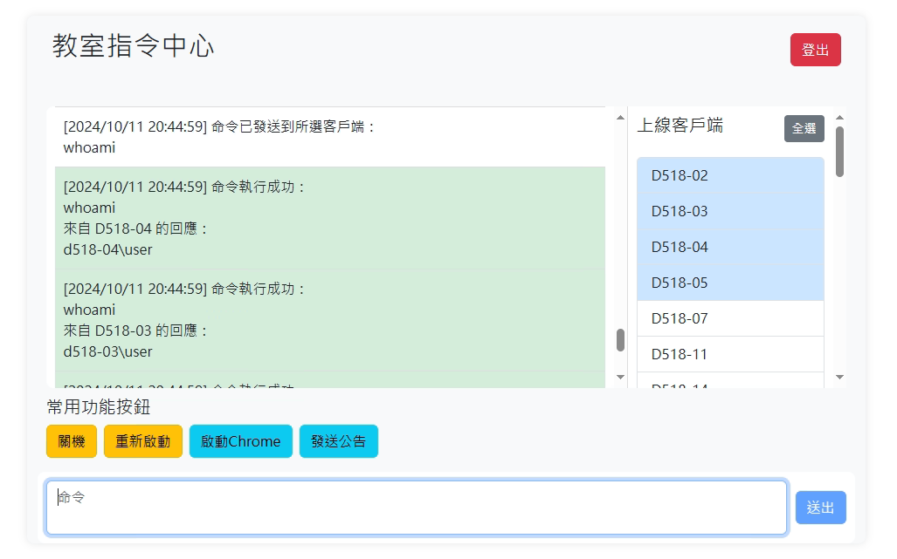

# 智慧教室指令系統 (Smart Classroom Command System)

## 介紹 (Introduction)

本系統是個人為了使用簡單的方法來批量對大量電腦下達指令而設計的教室管理系統。

系統設計了關機、重新啟動、啟動Chrome、發送PowerShell公告的快捷按鈕，方便教室管理員對室內的電腦進行集中控制。

## 文件結構 (File Structure)

- `server.py`: 伺服器端程式，負責處理用戶請求並發送指令到客戶端
- `client.py`: 客戶端程式，負責接收並執行來自伺服器的指令
- `login.html`: 登入頁面
- `chat.html`: 指令中心頁面

## 套件安裝 (Package Installation)

### 伺服器端 (Server Side)

```bash
pip install Flask Flask-SocketIO Flask-Login
```

### 客戶端 (Client Side)

```bash
pip install python-socketio
```

## 使用說明 (Usage Instructions)

### 伺服器端 (Server Side)

首先，打開 `server.py`，修改以下代碼以設置您要使用的端口號：

```python
if __name__ == '__main__':
    socketio.run(app, host='0.0.0.0', port=<YOUR_PORT>, debug=True)
```

然後，在命令行中運行伺服器：

```bash
python server.py
```

### 客戶端 (Client Side)

在使用 `client.py` 之前，需要修改以下代碼以設置伺服器的主機名和端口號：

```python
SERVER_HOSTNAME = "SERVER_HOSTNAME"
SERVER_PORT = <YOUR_PORT>
```

然後，在命令行中運行客戶端：

```bash
python client.py
```

### 使用 PyInstaller 打包 (Packaging with PyInstaller)

#### 客戶端 (Client Side)

```bash
pyinstaller --onefile --noconsole client.py
```

### 設置工作排程器 (Setting Up Task Scheduler)

1. 打開工作排程器，創建一個新的基本任務。
2. 設置觸發器為“登入時”。
3. 設置操作為“啟動程式”，選擇打包好的 `client.exe`。
4. 儲存。

## 使用說明 (Usage)

1. 首先，打開瀏覽器並進入 `127.0.0.1:<YOUR_PORT>`
2. 為了安全性，系統僅允許從 `127.0.0.1` 地址進行註冊
3. 註冊完成後，使用新註冊的帳號登入
4. 登入後，即可對其他客戶端下達指令

## 介面預覽 (Interface Preview)

- **登入頁面 (Login Page)**: 使用者進入系統時的登入介面。用戶需要輸入帳號和密碼進行身份驗證。

  
- **指令中心頁面 (Command Center Page)**: 登入後的主要操作介面，包含常用功能按鈕以及選擇用戶下命令的輸入框。

  
